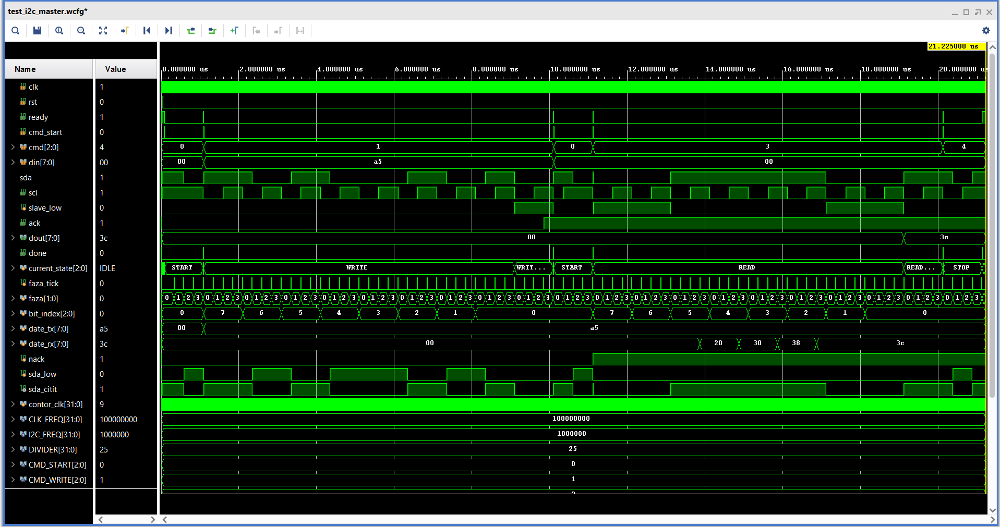

# Proiect_FPGA-Senzor_temperatura_I2C
Proiect FPGA pentru citirea temperaturii prin I2C, afisarea pe 7 segmente si transmiterea valorii prin UART.

## I2C și citirea temperaturii
Implementați un master I2C în SystemVerilog, fără IP core-uri Xilinx. Master-ul trebuie să comunice cu senzorul de temperatură de pe placă, să citească periodic valoarea temperaturii și să o convertească în grade Celsius conform specificațiilor din datasheet-ul senzorului.

## Rezolvare

Am inceput proiectul prin documentarea despre protocolul I2C si despre comunicarea dintre un dispozitiv master si unul sau mai multe dispozitive slave.

Am impartit proiectul in urmatoarele module:

- i2c_master - realizeaza operatiile de baza ale protocolului I2C;
- temp_controller - controleaza comenzile necesare citirii senzorului;
- temp_converter - converteste valoarea citita in grade Celsius.

Pentru afisarea temperaturii si a counter-ului voi reutiliza si adapta modulele realizate in primul proiect:

- binary_to_decimal;
- num;
- mux;
- transcodor_7seg;
- decodor_anod.

Temperatura va fi afisata pe cei patru digiti din stanga, iar counter-ul pe cei patru digiti din dreapta.

### Protocolul I2C

I2C este un protocol de comunicatie seriala sincrona care foloseste doua linii:

- SCL - semnalul de clock generat de master;
- SDA - linia bidirectionala folosita pentru transmiterea si receptionarea datelor.

O transmisie I2C contine:

- conditia de START;
- adresa slave-ului si bitul de citire/scriere;
- bitul ACK;
- transmiterea sau receptionarea datelor;
- transmiterea unui ACK sau NACK dupa citire;
- conditia de STOP.

Pentru implementare am ales frecventa standard de 100 kHz. Fiecare bit este impartit in patru faze, iar numarul de cicluri pentru o faza este:

DIVIDER = CLK_FREQ / (4 * I2C_FREQ)

Pentru un clock de 100 MHz si o frecventa I2C de 100 kHz rezulta:

DIVIDER = 250 cicluri

Cele patru faze ale unui bit sunt:

- faza 0 - SCL este 0 si se pregateste valoarea SDA;
- faza 1 - SCL trece la 1;
- faza 2 - valoarea SDA este mentinuta sau citita;
- faza 3 - SCL revine la 0.

## Structura modulului i2c_master

Modulul primeste comanda prin cmd, iar cmd_start porneste executarea acesteia. Byte-ul transmis este primit prin din, iar byte-ul receptionat este disponibil pe dout.

Am stabilit urmatoarele comenzi:

- CMD_START;
- CMD_WRITE;
- CMD_READ_ACK;
- CMD_READ_NACK;
- CMD_STOP.

Modulul este gandit sub forma unui FSM cu starile:

- IDLE - asteapta o comanda;
- START - genereaza conditia de START;
- HOLD - pastreaza transmisia activa si asteapta urmatoarea comanda;
- WRITE - transmite cei 8 biti;
- WRITE_ACK - citeste ACK-ul trimis de slave;
- READ - receptioneaza cei 8 biti;
- READ_ACK - transmite ACK sau NACK;
- STOP - genereaza conditia de STOP.

Semnalul ready arata ca modulul poate primi o comanda noua, iar done genereaza un impuls atunci cand comanda curenta a fost terminata.

La scriere, iesirea ack indica daca slave-ul a confirmat byte-ul transmis.

### Controlul liniei SDA

Initial, linia SDA era declarata ca inout si era controlata prin atribuirea valorilor 0 si 1'bz. De asemenea, in testbench era folosita o rezistenta pullup pentru obtinerea nivelului logic 1.

Pentru simplificarea modulului am separat magistrala SDA in doua semnale:

- sda_out - indica valoarea transmisa de master;
- sda_in - reprezinta valoarea citita de master.

Protocolul I2C foloseste iesiri de tip open-drain. Un dispozitiv poate trage linia SDA la 0 sau o poate elibera, iar nivelul 1 este obtinut prin rezistenta fizica de pull-up.

In modulul actual:

- sda_out = 0 inseamna ca master-ul trage linia la 0;
- sda_out = 1 inseamna ca master-ul elibereaza linia;
- sda_in este folosit pentru citirea datelor si a raspunsului ACK.

Astfel, modulul i2c_master nu mai foloseste un port inout, valoarea 1'bz sau o rezistenta pullup. Conectarea la pinul fizic bidirectional SDA va fi realizata ulterior in modulul top.

- [Codul modulului i2c_master](src/i2c_master.sv)

## Structura modulului i2c_dummy_slave

Pentru verificarea comunicatiei I2C am realizat modulul i2c_dummy_slave, folosit strict pentru simulare.

Am gandit modulul ca un slave I2C simplificat, care sa reproduca doar comportamentul necesar pentru verificarea modulului i2c_master. In loc ca raspunsurile slave-ului sa fie generate manual din testbench, acestea sunt realizate de un modul separat, care urmareste semnalele SCL si SDA si reactioneaza la comenzile master-ului.

Modulul este implementat sub forma unui FSM cu starile:

- WAIT_START - asteapta conditia de START;
- RECEIVE - receptioneaza cei 8 biti transmisi de master;
- SEND_ACK - transmite ACK catre master;
- WAIT_RESTART - asteapta conditia de repeated START;
- TRANSMIT - transmite valoarea hardcodata 3C;
- READ_NACK - asteapta raspunsul NACK al master-ului;
- WAIT_STOP - asteapta conditia de STOP.

La receptionare, slave-ul citeste valoarea liniei SDA la fiecare front pozitiv al semnalului SCL si formeaza treptat byte-ul primit. La transmitere, valoarea SDA este pregatita pe frontul negativ al lui SCL, astfel incat aceasta sa fie stabila atunci cand master-ul o citeste.

Pentru testare, slave-ul receptioneaza valoarea A5 transmisa de master, raspunde cu ACK, iar dupa repeated START transmite inapoi valoarea hardcodata 3C. La final, asteapta NACK-ul master-ului si conditia de STOP.

Astfel, comunicatia se realizeaza efectiv intre modulele i2c_master si i2c_dummy_slave.

- [Codul modulului i2c_dummy_slave](src/i2c_dummy_slave.sv)

## Simularea modulului i2c_master

Pentru verificare am conectat modulul i2c_master la i2c_dummy_slave, astfel incat transmiterea si receptionarea datelor sa fie realizate efectiv intre cele doua module.

Comportamentul magistralei SDA este simulat prin relatia:

sda_bus = master_sda_out & slave_sda_out

Atat master-ul, cat si slave-ul folosesc valoarea 0 pentru a trage linia la 0 si valoarea 1 pentru a o elibera. In acest mod nu mai sunt necesare valoarea 1'bz si rezistenta pullup in testbench.

Am verificat urmatoarea secventa:

START -> WRITE A5 -> ACK -> REPEATED START -> READ 3C -> NACK -> STOP

Master-ul transmite valoarea A5, iar dummy slave-ul o receptioneaza si raspunde cu ACK. Dupa repeated START, dummy slave-ul transmite valoarea 3C, care este receptionata de master. Master-ul raspunde cu NACK si genereaza apoi conditia de STOP.

In simulare am urmarit comenzile, semnalele SDA si SCL, starile FSM si datele transmise intre master si slave.

- [Testbench pentru i2c_master](sim/test_i2c_master.sv)

## Structura modulului temp_controller

Modulul temp_controller controleaza secventa necesara pentru citirea temperaturii prin intermediul modulului i2c_master.

Secventa folosita este:

- START;
- transmiterea adresei 96 pentru scriere;
- transmiterea registrului 00;
- repeated START;
- transmiterea adresei 97 pentru citire;
- citirea MSB cu ACK;
- citirea LSB cu NACK;
- STOP.

Modulul este gandit sub forma unui FSM cu starile:

- IDLE - asteapta pana la urmatoarea citire;
- SEND_START - trimite comanda START;
- WAIT_START - asteapta terminarea comenzii;
- SEND_ADD_WR - trimite adresa senzorului pentru scriere;
- WAIT_ADD_WR - asteapta raspunsul si verifica ACK-ul;
- SEND_REG - trimite registrul de temperatura;
- WAIT_REG - asteapta raspunsul si verifica ACK-ul;
- SEND_RESTART - trimite repeated START;
- WAIT_RESTART - asteapta terminarea comenzii;
- SEND_ADD_RD - trimite adresa senzorului pentru citire;
- WAIT_ADD_RD - asteapta raspunsul si verifica ACK-ul;
- SEND_RD_MSB - citeste primul byte si trimite ACK;
- WAIT_RD_MSB - memoreaza byte-ul MSB;
- SEND_RD_LSB - citeste al doilea byte si trimite NACK;
- WAIT_RD_LSB - formeaza valoarea temperature_raw;
- SEND_STOP - trimite comanda STOP;
- WAIT_STOP - asteapta terminarea citirii.

Cei doi bytes cititi formeaza valoarea temperature_raw pe 16 biti. data_valid indica o citire completa, iar ack_error semnaleaza lipsa unui ACK.

Citirea este realizata periodic folosind FIRST_READ_DELAY si READ_INTERVAL. Am ales FIRST_READ_DELAY = 1_000_000, adica aproximativ 10 ms la 100 MHz, deoarece prima conversie a senzorului dupa pornire dureaza aproximativ 6 ms. READ_INTERVAL = 24_000_000 corespunde la aproximativ 240 ms, valoare aleasa in functie de timpul unei conversii normale a senzorului.

- [Codul modulului temp_controller](src/temp_controller.sv)
