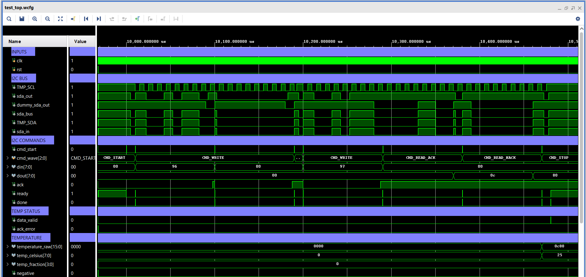
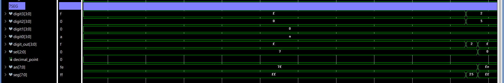

# Proiect_FPGA-Senzor_temperatura_I2C
Proiect FPGA pentru citirea temperaturii prin I2C, afisarea pe 7 segmente si transmiterea valorii prin UART.

## I2C și citirea temperaturii
Implementați un master I2C în SystemVerilog, fără IP core-uri Xilinx. Master-ul trebuie să comunice cu senzorul de temperatură de pe placă, să citească periodic valoarea temperaturii și să o convertească în grade Celsius conform specificațiilor din datasheet-ul senzorului.

## Rezolvare

Am inceput proiectul prin documentarea despre protocolul I2C si despre comunicarea dintre un dispozitiv master si unul sau mai multe dispozitive slave.

Am impartit proiectul in urmatoarele module:

- i2c_master - realizeaza operatiile de baza ale protocolului I2C;
- temp_controller - controleaza comenzile necesare citirii senzorului;
- temp_converter - converteste valoarea citita in grade Celsius.

Pentru afisarea temperaturii si a counter-ului voi reutiliza si adapta modulele realizate in primul proiect:

- binary_to_decimal;
- num;
- mux;
- transcodor_7seg;
- decodor_anod.

Temperatura va fi afisata pe cei patru digiti din stanga, iar counter-ul pe cei patru digiti din dreapta.

### Protocolul I2C

I2C este un protocol de comunicatie seriala sincrona care foloseste doua linii:

- SCL - semnalul de clock generat de master;
- SDA - linia bidirectionala folosita pentru transmiterea si receptionarea datelor.

O transmisie I2C contine:

- conditia de START;
- adresa slave-ului si bitul de citire/scriere;
- bitul ACK;
- transmiterea sau receptionarea datelor;
- transmiterea unui ACK sau NACK dupa citire;
- conditia de STOP.

Pentru implementare am ales frecventa standard de 100 kHz. Fiecare bit este impartit in patru faze, iar numarul de cicluri pentru o faza este:

DIVIDER = CLK_FREQ / (4 * I2C_FREQ)

Pentru un clock de 100 MHz si o frecventa I2C de 100 kHz rezulta:

DIVIDER = 250 cicluri

Cele patru faze ale unui bit sunt:

- faza 0 - SCL este 0 si se pregateste valoarea SDA;
- faza 1 - SCL trece la 1;
- faza 2 - valoarea SDA este mentinuta sau citita;
- faza 3 - SCL revine la 0.

## Structura modulului i2c_master

Modulul primeste comanda prin cmd, iar cmd_start porneste executarea acesteia. Byte-ul transmis este primit prin din, iar byte-ul receptionat este disponibil pe dout.

Am stabilit urmatoarele comenzi:

- CMD_START;
- CMD_WRITE;
- CMD_READ_ACK;
- CMD_READ_NACK;
- CMD_STOP.

Modulul este gandit sub forma unui FSM cu starile:

- IDLE - asteapta o comanda;
- START - genereaza conditia de START;
- HOLD - pastreaza transmisia activa si asteapta urmatoarea comanda;
- WRITE - transmite cei 8 biti;
- WRITE_ACK - citeste ACK-ul trimis de slave;
- READ - receptioneaza cei 8 biti;
- READ_ACK - transmite ACK sau NACK;
- STOP - genereaza conditia de STOP.

Semnalul ready arata ca modulul poate primi o comanda noua, iar done genereaza un impuls atunci cand comanda curenta a fost terminata.

La scriere, iesirea ack indica daca slave-ul a confirmat byte-ul transmis.

### Controlul liniei SDA

Initial, linia SDA era declarata ca inout si era controlata prin atribuirea valorilor 0 si 1'bz. De asemenea, in testbench era folosita o rezistenta pullup pentru obtinerea nivelului logic 1.

Pentru simplificarea modulului am separat magistrala SDA in doua semnale:

- sda_out - indica valoarea transmisa de master;
- sda_in - reprezinta valoarea citita de master.

Protocolul I2C foloseste iesiri de tip open-drain. Un dispozitiv poate trage linia SDA la 0 sau o poate elibera, iar nivelul 1 este obtinut prin rezistenta fizica de pull-up.

In modulul actual:

- sda_out = 0 inseamna ca master-ul trage linia la 0;
- sda_out = 1 inseamna ca master-ul elibereaza linia;
- sda_in este folosit pentru citirea datelor si a raspunsului ACK.

Astfel, modulul i2c_master nu mai foloseste un port inout, valoarea 1'bz sau o rezistenta pullup. Conectarea la pinul fizic bidirectional SDA va fi realizata ulterior in modulul top.

- [Codul modulului i2c_master](src/i2c/i2c_master.sv)

## Structura modulului i2c_dummy_slave

Pentru verificarea comunicatiei I2C am realizat modulul i2c_dummy_slave, folosit strict pentru simulare.

Modulul functioneaza ca un slave I2C simplificat si este folosit atat pentru verificarea separata a modulului i2c_master, cat si pentru simularea completa a citirii temperaturii.

In functie de primul byte receptionat, dummy slave-ul poate urma doua secvente diferite. Pentru testarea modulului i2c_master receptioneaza valoarea A5 si transmite valoarea 3C. Pentru simularea citirii temperaturii receptioneaza comenzile pentru senzor si transmite valoarea 0C80, corespunzatoare unei temperaturi de 25.0 grade.

Modulul este implementat sub forma unui FSM cu starile:

- WAIT_START - asteapta conditia de START;
- RECEIVE_FIRST - receptioneaza primul byte transmis de master;
- SEND_ACK_FIRST - transmite ACK pentru primul byte;
- RECEIVE_REG - receptioneaza registrul de temperatura;
- SEND_ACK_REG - transmite ACK pentru registru;
- WAIT_RESTART - asteapta conditia de repeated START;
- RECEIVE_ADD_RD - receptioneaza adresa pentru citire;
- SEND_ACK_RD - transmite ACK pentru adresa de citire;
- TRANSMIT_OLD - transmite valoarea 3C pentru testarea separata a master-ului;
- READ_NACK_OLD - asteapta NACK-ul master-ului pentru testul simplu;
- TRANSMIT_MSB - transmite byte-ul MSB al temperaturii;
- READ_ACK - asteapta ACK-ul master-ului;
- TRANSMIT_LSB - transmite byte-ul LSB al temperaturii;
- READ_NACK_TEMP - asteapta NACK-ul master-ului dupa citirea temperaturii;
- WAIT_STOP - asteapta conditia de STOP.

La receptionare, slave-ul citeste valoarea liniei SDA la fiecare front pozitiv al semnalului SCL. La transmitere, valoarea SDA este pregatita pe frontul negativ al lui SCL, astfel incat aceasta sa fie stabila atunci cand master-ul o citeste.

Pentru testarea separata a master-ului este folosita secventa:

START -> WRITE A5 -> ACK -> REPEATED START -> READ 3C -> NACK -> STOP

Pentru simularea citirii temperaturii este folosita secventa:

START -> WRITE 96 -> ACK -> WRITE 00 -> ACK -> REPEATED START -> WRITE 97 -> ACK -> READ 0C -> ACK -> READ 80 -> NACK -> STOP

- [Codul modulului i2c_dummy_slave](src/i2c/i2c_dummy_slave.sv)

## Simularea modulului i2c_master

Pentru verificare am conectat modulul i2c_master la i2c_dummy_slave, astfel incat transmiterea si receptionarea datelor sa fie realizate efectiv intre cele doua module.

Comportamentul magistralei SDA este simulat prin relatia:

sda_bus = master_sda_out & slave_sda_out

Atat master-ul, cat si slave-ul folosesc valoarea 0 pentru a trage linia la 0 si valoarea 1 pentru a o elibera. In acest mod nu mai sunt necesare valoarea 1'bz si rezistenta pullup in testbench.

Pentru verificarea separata a modulului i2c_master am folosit secventa:

START -> WRITE A5 -> ACK -> REPEATED START -> READ 3C -> NACK -> STOP

Master-ul transmite valoarea A5, iar dummy slave-ul o receptioneaza si raspunde cu ACK. Dupa repeated START, dummy slave-ul transmite valoarea 3C, care este receptionata de master. Master-ul raspunde cu NACK si genereaza apoi conditia de STOP.

In simulare am urmarit comenzile, semnalele SDA si SCL, starile FSM si datele transmise intre master si slave.

- [Testbench pentru i2c_master](sim/test_i2c_master.sv)

- 

# Citirea si prelucrarea temperaturii

Pentru citirea si prelucrarea temperaturii sunt folosite modulele temp_controller, temp_converter si temp_to_digits.

temp_controller controleaza secventa de comunicatie cu senzorul, temp_converter realizeaza conversia valorii brute in grade Celsius, iar temp_to_digits pregateste valoarea pentru afisarea pe display.

## Structura modulului temp_controller

Modulul temp_controller controleaza secventa necesara pentru citirea temperaturii prin intermediul modulului i2c_master.

Secventa folosita este:

- START;
- transmiterea adresei 96 pentru scriere;
- transmiterea registrului 00;
- repeated START;
- transmiterea adresei 97 pentru citire;
- citirea MSB cu ACK;
- citirea LSB cu NACK;
- STOP.

Modulul este gandit sub forma unui FSM cu starile:

- IDLE - asteapta pana la urmatoarea citire;
- SEND_START - trimite comanda START;
- WAIT_START - asteapta terminarea comenzii;
- SEND_ADD_WR - trimite adresa senzorului pentru scriere;
- WAIT_ADD_WR - asteapta raspunsul si verifica ACK-ul;
- SEND_REG - trimite registrul de temperatura;
- WAIT_REG - asteapta raspunsul si verifica ACK-ul;
- SEND_RESTART - trimite repeated START;
- WAIT_RESTART - asteapta terminarea comenzii;
- SEND_ADD_RD - trimite adresa senzorului pentru citire;
- WAIT_ADD_RD - asteapta raspunsul si verifica ACK-ul;
- SEND_RD_MSB - citeste primul byte si trimite ACK;
- WAIT_RD_MSB - memoreaza byte-ul MSB;
- SEND_RD_LSB - citeste al doilea byte si trimite NACK;
- WAIT_RD_LSB - formeaza valoarea temperature_raw;
- SEND_STOP - trimite comanda STOP;
- WAIT_STOP - asteapta terminarea citirii.

Cei doi bytes cititi formeaza valoarea temperature_raw pe 16 biti. data_valid indica o citire completa, iar ack_error semnaleaza lipsa unui ACK.

Citirea este realizata periodic folosind FIRST_READ_DELAY si READ_INTERVAL. Am ales FIRST_READ_DELAY = 1_000_000, adica aproximativ 10 ms la 100 MHz, deoarece prima conversie a senzorului dupa pornire dureaza aproximativ 6 ms. READ_INTERVAL = 24_000_000 corespunde la aproximativ 240 ms, valoare aleasa in functie de timpul unei conversii normale a senzorului.

- [Codul modulului temp_controller](src/i2c/temp_controller.sv)

## Structura modulului temp_converter

Modulul temp_converter realizeaza conversia valorii brute primite de la senzor in grade Celsius.

Valoarea temperaturii este separata in partea intreaga, partea zecimala si semn. Pentru temperaturile negative, valoarea este pastrata pozitiva pentru afisaj, iar semnul este transmis separat pentru a putea fi folosit la UART.

- [Codul modulului temp_converter](src/i2c/temp_converter.sv)

## Structura modulului temp_to_digits

Modulul temp_to_digits pregateste cifrele necesare pentru afisarea temperaturii pe display-ul cu 7 segmente.

Temperatura este pregatita pentru afisare in formatul 25.0°, iar pentru valorile sub 10 grade prima pozitie este lasata libera.

- [Codul modulului temp_to_digits](src/i2c/temp_to_digits.sv)

## Integrarea initiala - modulul top

Am realizat modulul top pentru integrarea initiala a partii de citire si afisare a temperaturii.

Am conectat temp_controller cu i2c_master pentru realizarea citirii temperaturii, iar valoarea obtinuta este trimisa mai departe catre temp_converter si temp_to_digits pentru conversie si pregatirea cifrelor.

Pentru afisare am integrat modulele num, mux, transcodor_7seg si decodor_anod. Temperatura este afisata pe cei patru digiti din stanga in formatul 25.0°.

Am conectat si i2c_dummy_slave pentru simularea comunicatiei I2C, iar pentru functionarea pe placa linia SDA este legata la senzor prin IOBUF.

Astfel, modulul top leaga toate modulele necesare pentru citirea, conversia si afisarea temperaturii.

- [Codul modulului top initial](src/top.sv)

## Simularea integrarii initiale

Am realizat modulul test_top pentru verificarea functionarii partii cu temperatura a proiectului.

In simulare am verificat impreuna citirea temperaturii prin I2C, conversia valorii primite si pregatirea acesteia pentru afisarea pe display-ul cu 7 segmente.

Testbench-ul genereaza semnalul de clock si reset-ul, iar dupa reset modulele din top functioneaza automat.

Pentru simularea senzorului am folosit i2c_dummy_slave, care raspunde comenzilor I2C si transmite valoarea 0C80, corespunzatoare unei temperaturi de 25.0 grade.

In waveform am urmarit comenzile I2C, valorile transmise si receptionate, semnalele ACK si data_valid, valoarea temperature_raw si rezultatul obtinut dupa conversie.

La finalul simularii, temperature_raw are valoarea 0C80, iar temperatura obtinuta este 25.0 grade. Cifrele rezultate sunt pregatite pentru afisarea valorii 25.0° pe cei patru digiti din stanga.

- [Testbench pentru modulul top initial](sim/test_top.sv)

# Counter si controlul prin butoane

Pentru controlul counter-ului am reutilizat si adaptat modulele realizate in proiectul UART anterior.

Counter-ul poate fi controlat atat prin comenzile primite prin UART, cat si prin cele trei butoane ale placii pentru incrementare, decrementare si resetare.

## Module pentru butoane

Pentru prelucrarea semnalelor provenite de la butoane sunt folosite modulele button_sync, debouncer si edge_detector.

## Structura modulului button_sync

Modulul button_sync realizeaza sincronizarea semnalului primit de la buton cu semnalul de clock al sistemului.

Pentru sincronizare sunt folosite doua registre succesive. Structura modulului a fost pastrata fata de proiectul UART anterior.

- [Codul modulului button_sync](src/counter/button_sync.sv)

## Structura modulului debouncer

Modulul debouncer elimina oscilatiile care pot aparea la apasarea sau eliberarea unui buton.

Schimbarea starii este acceptata doar daca noua valoare ramane stabila pentru un anumit numar de cicluri de clock.

Fata de proiectul anterior, valoarea MAX_COUNT a fost transformata intr-un parametru. In functionarea pe placa aceasta ramane implicit 2_000_000, iar in simulare poate fi redusa pentru scurtarea timpului necesar testarii butoanelor.

- [Codul modulului debouncer](src/counter/debouncer.sv)

## Structura modulului edge_detector

Modulul edge_detector detecteaza frontul crescator al semnalului stabilizat de la buton.

La fiecare apasare este generat un impuls cu durata de un singur ciclu de clock, folosit pentru incrementarea, decrementarea sau resetarea counter-ului.

Structura modulului a fost pastrata fata de proiectul UART anterior.

- [Codul modulului edge_detector](src/counter/edge_detector.sv)

## Module pentru counter

## Structura modulului counter14b

Modulul counter14b realizeaza counter-ul folosit in proiect.

Fata de counter-ul pe 16 biti folosit in proiectul UART anterior, acesta a fost modificat la 14 biti si limitat la intervalul 0 - 9999, deoarece valoarea trebuie afisata pe cele patru pozitii din dreapta ale display-ului.

La incrementarea valorii 9999, counter-ul revine la 0 si este generat semnalul overflow.

La decrementarea valorii 0, counter-ul trece la 9999 si este generat semnalul underflow.

Counter-ul poate fi si resetat direct la valoarea 0.

- [Codul modulului counter14b](src/counter/counter14b.sv)

## Structura modulului binary_to_decimal

Modulul binary_to_decimal transforma valoarea counter-ului in patru cifre zecimale.

Acest modul este necesar pentru afisarea valorii pe cele patru pozitii din dreapta ale display-ului cu 7 segmente.

Sunt obtinute separat cifra unitatilor, zecilor, sutelor si miilor.

- [Codul modulului binary_to_decimal](src/counter/binary_to_decimal.sv)

## Structura modulului counter_to_ascii

Modulul counter_to_ascii pregateste valoarea counter-ului pentru transmiterea prin UART.

Fata de varianta folosita anterior pentru counter-ul pe 16 biti, modulul a fost adaptat pentru noua valoare pe 14 biti.

Formatul transmis a fost pastrat sub forma 0xXXXX pentru a ramane compatibil cu mesajele realizate in proiectul UART anterior.

- [Codul modulului counter_to_ascii](src/counter/counter_to_ascii.sv)

# Comunicatia UART

Pentru comunicarea cu PC-ul am pornit de la structura realizata in proiectul UART Counter Logger si am adaptat-o pentru proiectul actual.

Am pastrat arhitectura formata din receptie UART, FIFO pentru receptie, decodarea si controlul comenzilor, generarea mesajelor, FIFO pentru transmisie si modulul UART TX.

Fata de proiectul anterior am adaugat transmiterea temperaturii si am extins mesajul de status astfel incat sa contina atat valoarea counter-ului, cat si temperatura curenta.

## Structura modulului uart_rx

Modulul uart_rx realizeaza receptionarea caracterelor trimise de la PC prin UART.

Acesta detecteaza bitul de start, receptioneaza cei 8 biti de date si verifica bitul de stop. La final, caracterul receptionat este disponibil pe rx_data, iar rx_done indica terminarea receptiei.

Structura modulului a fost pastrata fata de proiectul UART anterior. In proiectul actual comunicatia este realizata la 9600 baud.

- [Codul modulului uart_rx](src/uart/uart_rx.sv)

## Structura modulului uart_tx

Modulul uart_tx realizeaza transmiterea caracterelor catre PC prin UART.

Pentru fiecare caracter sunt transmise bitul de start, cei 8 biti de date si bitul de stop. Semnalul tx_busy indica faptul ca o transmisie este in curs, iar tx_done indica terminarea acesteia.

Structura modulului a fost pastrata fata de proiectul UART anterior, comunicatia fiind realizata la 9600 baud.

- [Codul modulului uart_tx](src/uart/uart_tx.sv)

## Structura modulului uart_senzor_command_decoder

Modulul uart_senzor_command_decoder identifica comenzile primite prin UART.

Am pastrat comenzile folosite in proiectul anterior:

- I/i - incrementare;
- D/d - decrementare;
- R/r - reset;
- S/s - status;
- ? - ajutor.

Pentru proiectul actual am adaugat si:

- T/t - afisarea temperaturii.

- [Codul modulului uart_senzor_command_decoder](src/uart/uart_senzor_command_decoder.sv)

## Structura modulului uart_senzor_command_control

Modulul uart_senzor_command_control gestioneaza comenzile primite prin UART si impulsurile generate de butoanele placii.

Modulul controleaza incrementarea, decrementarea si resetarea counter-ului si selecteaza mesajul care trebuie transmis catre PC.

Fata de varianta folosita anterior am adaugat tratarea comenzii pentru temperatura prin mesajul MSG_TEMP.

- [Codul modulului uart_senzor_command_control](src/uart/uart_senzor_command_control.sv)

## Structura modulului temp_to_ascii

Modulul temp_to_ascii pregateste temperatura pentru transmiterea prin UART.

Partea intreaga, partea zecimala si semnul temperaturii sunt transformate in caractere ASCII.

Spre deosebire de afisarea pe display-ul cu 7 segmente, prin UART poate fi transmis si semnul temperaturilor negative.

- [Codul modulului temp_to_ascii](src/i2c/temp_to_ascii.sv)

## Structura modulului message_sender

Modulul message_sender construieste mesajele transmise catre PC.

Am pornit de la modulul folosit in proiectul UART Counter Logger si l-am extins pentru proiectul actual.

Am adaugat mesajul pentru comanda T/t, transmis sub forma:

"Temperatura: 25.0 grade Celsius"

De asemenea, mesajul pentru comanda S/s a fost modificat astfel incat statusul sa contina atat valoarea counter-ului, cat si temperatura curenta.

Mesajul de ajutor a fost actualizat pentru a include si noua comanda T/t.

- [Codul modulului message_sender](src/uart/message_sender.sv)

## IP-uri folosite pentru UART

Pentru integrarea partii UART am folosit un Clocking Wizard si un FIFO Generator.

Clocking Wizard-ul furnizeaza ceasul de 100 MHz folosit de sistem si semnalul locked, utilizat pentru generarea resetului global.

FIFO Generator este folosit de doua ori in modulul top_complet:

- un FIFO pentru receptia datelor UART;
- un FIFO pentru transmisia datelor UART.

- [Configurare Clocking Wizard](src/ip/clk_wiz_uart_senzor.xci)
- [Configurare FIFO UART](src/ip/fifo_uart_senzor.xci)

# Afisarea pe display

Pentru afisarea informatiilor am reutilizat si adaptat modulele realizate anterior pentru display-ul cu 7 segmente.

In varianta finala sunt folosite toate cele 8 pozitii ale display-ului: temperatura este afisata pe cele patru pozitii din stanga, iar valoarea counter-ului pe cele patru pozitii din dreapta.

## Structura modulului num

Modulul num este folosit pentru multiplexarea display-ului cu 7 segmente.

Acesta realizeaza un contor pe 20 de biti, iar bitii 18:16 sunt folositi pentru selectarea succesiva a celor 8 pozitii ale display-ului.

Structura modulului a fost pastrata fata de varianta folosita anterior.

- [Codul modulului num](src/display/num.sv)

## Structura modulului mux

Modulul mux selecteaza una dintre cele 8 valori care trebuie afisate, in functie de semnalul sel.

Fata de varianta initiala, in care erau folosite doar cele patru pozitii din stanga pentru temperatura, am extins afisarea astfel incat sa fie utilizate toate cele 8 pozitii.

Cele patru pozitii din stanga sunt folosite pentru temperatura, iar cele patru pozitii din dreapta sunt folosite pentru valoarea counter-ului.

- [Codul modulului mux](src/display/mux.sv)

## Structura modulului transcodor_7seg

Modulul transcodor_7seg transforma valoarea selectata in semnalele necesare pentru aprinderea segmentelor display-ului.

Pe langa cifrele de la 0 la 9, sunt folosite coduri pentru simbolul de grad si pentru o pozitie libera.

Semnalul decimal_point este folosit pentru afisarea punctului zecimal al temperaturii, astfel incat aceasta sa fie afisata in formatul 25.0°.

Structura principala a modulului a fost pastrata fata de varianta realizata anterior.

- [Codul modulului transcodor_7seg](src/display/transcodor_7seg.sv)

## Structura modulului decodor_anod

Modulul decodor_anod selecteaza una dintre cele 8 pozitii ale display-ului in functie de semnalul sel.

Anozii sunt activi pe 0, iar in timpul functionarii normale este activata succesiv cate o singura pozitie.

Fata de varianta initiala am adaugat semnalul de reset. Atunci cand resetul global este activ, toti anozii sunt dezactivati, astfel incat display-ul sa fie complet stins.

- [Codul modulului decodor_anod](src/display/decodor_anod.sv)

